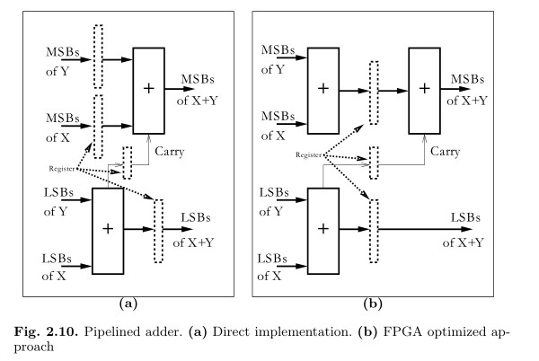
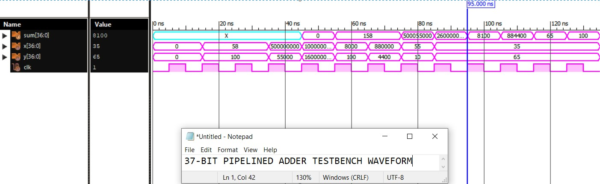
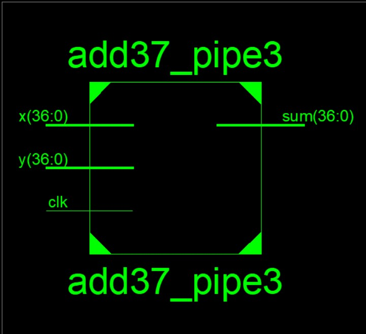
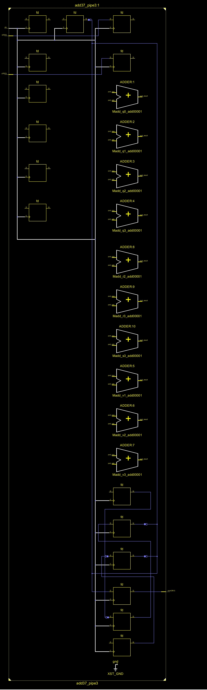

# RTL Design of a 37-Bit Adder with 3 Stages Pipelining using Xilinx ISE

This repository is aimed around the design of a 37-bit pipelined adder that features the process of pipelining in three stages on the Xilinx ISE Design Suite 14.7.

# Table of Contents
 * [Introduction](#Introduction)
 * [Background](#Background)
 * [Block Diagram](#Block-Diagram)
 * [Tools Used](#Tools-Used)
 * [RTL Coding and Simulation](#RTL-Coding-and-Simulation)
 * [Synthesis](#Synthesis)
 * [Conclusion](#Conclusion)
 * [Author](#Author)
 * [References](#References)

# Introduction

A basic binary N-bit adder/subtractor consists of N full-adders (FA). Pipelining is a technique that shortens the circuit delay by placing a register in a combinational logic path to break the critical path. Pipelining has the advantage to get high throughput of a circuit because the register-to-register delay is the delay path that sets the clock rate.
Another application domain of pipelining is that it is extensively used in DSP solutions due to the intrinsic dataflow regularity of DSP algorithms. Programmable digital signal processor MACs [6,16,17] typically carry at least four pipelined stages. The processor:
1)	Decodes the command
2)	Loads the operands in registers
3)	Performs multiplication and stores the product, and
4)	Accumulates the products, all concurrently

# Background

-> The pipelining principle can be applied to FPGA designs, at little or no additional cost since each logic element contains a flip-flop, which is otherwise unused, to save routing resources.
-> With pipelining it is possible to break an arithmetic operation into small primitive operations, save the carry and the intermediate values in registers, and continue the calculation in the next clock cycle. 
Such adders are sometimes called carry save adders4 (CSAs) in the literature. Then the question arises: In how many pieces should we divide the adder? Should we use bit level? 
-> For Altera’s Cyclone IV devices a reasonable choice will be always using an LAB with 16 LEs and 16 FFs for one pipeline element. The FLEX10K family has 8 LEs per LAB, while APEX20KE uses 10 LEs per LAB. So, we need to consult the datasheet before we make a decision on the size of the pipelining group. 
-> In fact, it can be shown that if we try to pipeline (for instance) a 14-bit adder in our Cyclone IV devices, the performance does not improve, as reported in Table 2.7, because the pipelined 14-bit adder does not fit in one LAB. 
-> Because the number of flip-flops in one LAB is 16 and we need an extra flip-flop for the carry-out, we should use a maximum block size of 15 bits for maximum registered performance. 
-> Only the blocks with the MSBs can be 16 bits wide, because we do not need the extra flip-flop for the carry. 

-> This observation leads to the following conclusions:
•	With one additional pipeline stage we can build adders up to a length
15 + 16 = 31.
•	With two pipeline stages we can build adders with up to 
15+15+16 = 46-bit length.
•	With three pipeline stages we can build adders with up to 
15+ 15+ 15+16 = 61-bit length.

# Block Diagram

 
  Fig 1: Reference Block Diagram

Figure above represents the logic diagram used as reference when designing the RTL code.
   

# Tools Used

<b>• Xilinx ISE Design Suite 14.7:</b> 
ISE® Design Suite is a proven and mature development environment for All Programmable devices. It is an impressive package that has got tools for boosting the designer productivity plus additionally, it supplies the flexible configurations of this Design Suite Editions.  
To know more, kindly refer to: <a href='https://www.xilinx.com/products/design-tools/ise-design-suite.html'>Xilinx ISE Design Suite</a> 

<b>• ISim Simulator:</b> 
ISim provides a complete, full-featured HDL simulator integrated within ISE. HDL simulation now can be an even more fundamental step within your design flow with the tight integration of the ISim within your design environment.
To know more, kindly refer to: <a href='https://www.xilinx.com/products/design-tools/isim.html'>Xilinx ISim</a> 

# RTL Coding and Simulation

## Verilog Coding:

For RTL level Verilog code, kindly refer to: <a href='https://github.com/guptayush2112/Pipe3_Adder37/blob/main/Source%20Codes/add37_pipe3.v'>Verilog Code</a> 

For Testbench code, kindly refer to: <a href='https://github.com/guptayush2112/Pipe3_Adder37/blob/main/Source%20Codes/Testbench/add37_pipe3_tb.v'>Testbench</a> 

## Testbench Simulation:

For the different 37-bit values of inputs we can see how the output labelled as sum is being obtained.

   
  Fig. 3 (a): Testbench of 37-bit adder

# Synthesis

Initially, after the function implementation of the design was verified through the testbench simulation, the design was then synthesized to get the RTL view of the same.

## Top-Level Block:

   

## Detailed RTL View:

   

	

# Conclusion:
Thus, we saw how a 37-bit adder was implemented with three pipelined stages and its logic was successfully realized. 

# Author:
• Ayush Gupta, B.Tech(ECE), SRM Institute of Science and Technology, Kattankulattur, Chennai-603203.

# References:
[1] O. Spaniol: Computer Arithmetic: Logic and Design (John Wiley & Sons, New York, 1981)
